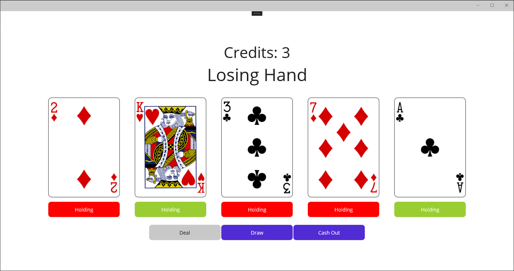

# Real World Interactions - Final Project
## Jochem Arends - 495637

### Note
On blackboard the file "syllabus.pdf" under "General Information" says that we needed to make a sequence diagram.
But the "FINAL.pdf" under "Examination" doesn't. I still made one but its quite simple. But am not sure if its correct.

### Dependencies
In order to build the project the MAUI framework should be installed.
I used the Deck Of Cards API in my application, which can be found at https://deckofcardsapi.com/

### Project
I've made a game where one can play a simple version Video Poker. Video Poker knows several variants. 
For this project I used the "Jacks or Better" variant of the game. When a game starts the player gets dealt five random cards.
The player now has one chance to exchange some cards for random new ones. Whenever the player has a specific combination of cards,
the player will receive credits bound to that hand. After this the process repeats. The goal is to make a combinations of cards that give the highest reward.

The cost of a deal is one credit and the rewards per card combination are shown below.

| Hand            | Reward |
|-----------------|--------|
| Jacks or Better | 1      |
| Three of a Kind | 2      |
| Straight        | 3      |
| Flush           | 4      |
| Full House      | 5      |
| Four of a Kind  | 6      |
| Straight Flush  | 7      |
| Royal Flush     | 8      |

### Screenshot

The implementation of the rules may be incorrect since before this project I was not familiar with Video Poker, let alone Poker in general.
